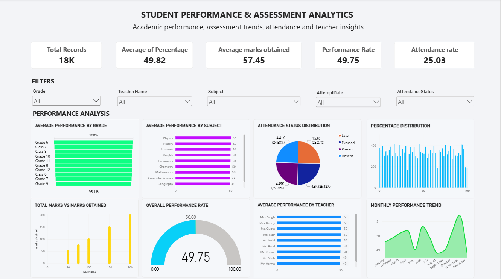

# Student Performance & Assessment Analytics

## Project Overview

**Student Performance & Assessment Analytics** is a data analysis and business intelligence project developed to analyze student assessment performance, attendance patterns, subject-wise performance, teacher-wise performance, and performance trends over time.

The project covers the complete data analytics workflow, including **data cleaning using Python, data analysis using SQL, and interactive visualization using Power BI**.

## Objectives

- Analyze overall student performance.
- Compare performance across subjects and grades.
- Analyze attendance status distribution.
- Identify performance trends over time.
- Compare total marks with marks obtained.
- Analyze teacher-wise student performance.
- Present key performance indicators through an interactive Power BI dashboard.

## Technologies Used

- **Python** – Data cleaning and preprocessing
- **Pandas** – Data manipulation and analysis
- **Matplotlib & Seaborn** – Data visualization
- **MySQL** – SQL-based data analysis
- **Power BI** – Interactive dashboard and business intelligence
- **Jupyter Notebook** – Python analysis environment

## Project Workflow

### 1. Data Exploration
The dataset was explored to understand its structure, columns, data types, missing values, duplicate records, and overall data quality.

### 2. Data Cleaning
The dataset was cleaned using Python and Pandas by:

- Handling missing values
- Filling empty values where required
- Removing duplicate records
- Correcting data types
- Removing unnecessary data where required

### 3. Data Analysis
SQL queries were used to analyze the cleaned dataset and extract meaningful insights related to student performance and assessment results.

### 4. Data Visualization
The analyzed data was visualized using Python and Power BI to identify patterns, comparisons, distributions, and trends.

### 5. Power BI Dashboard
An interactive dashboard was created with KPI cards, filters, and multiple visualizations.

## Power BI Dashboard

The dashboard includes:

- Total Records
- Average Percentage
- Average Marks Obtained
- Performance Rate
- Attendance Rate
- Average Performance by Grade
- Average Performance by Subject
- Attendance Status Distribution
- Percentage Distribution
- Total Marks vs Marks Obtained
- Overall Performance Rate
- Average Performance by Teacher
- Monthly Performance Trend

### Dashboard Preview



## Repository Structure

```text
Data-visualization/
│
├── README.md
├── Student_Performance_Assessment_Analytics.pbix
├── Student_Performance_Dashboard.png
├── Student_Data_Analysis.ipynb
├── SQL_data_Analysis.sql
└── cleaned_data.csv
```

## Key Outcome

The project transforms raw student assessment data into a structured analytical solution that combines **Python, SQL, and Power BI** to support data-driven understanding of student performance and assessment patterns.

## Project Deliverables

- Cleaned dataset
- Python analysis notebook
- SQL analysis queries
- Power BI dashboard
- Dashboard preview
- Project documentation
